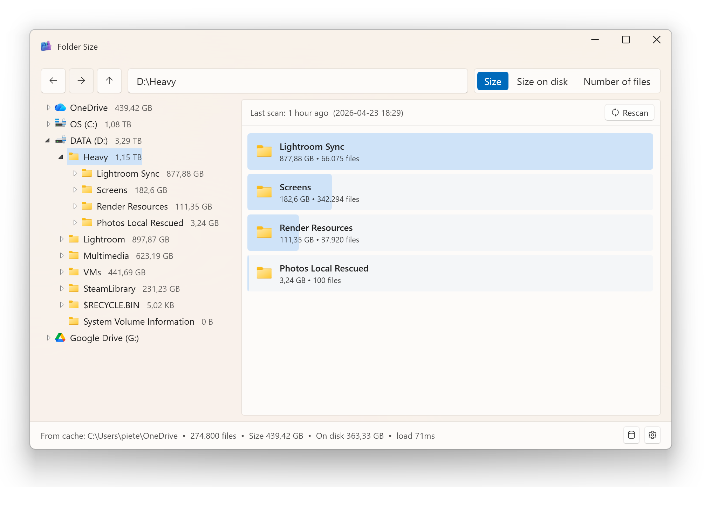

<p align="center">
  
</p>

<h1 align="center">Folder Size</h1>

<p align="center">A fast, beautiful disk-space analyzer for Windows 11.</p>

<p align="center">
Built with WPF + Fluent Design (Mica backdrop, native dark/light/system theming) on top of a parallel Win32 scanner that handles drives with millions of files without breaking a sweat.
</p>



---

## Why

Most disk analyzers either look like they were designed in 2005 or hide simple things behind a paywall. Folder Size is the small, sharp tool that just does the job:

- **Looks at home in Windows 11.** Fluent Design with a Mica backdrop, native title-bar integration, follows your system theme.
- **Three metrics in one pass.** Logical **Size**, **Size on disk** (cluster-rounded), and **Number of files**. Switch between them instantly — no rescan needed.
- **Persistent cache.** Every scan is gzipped into a local SQLite database. Reopening the app is instant; rescanning is one click. The DB self-vacuums and prunes redundant descendant scans automatically.
- **Windows Explorer integration (optional).** Right-click any folder, drive, or folder background → *Folder Size*.
- **Multi-scan, smart scheduling.** Scans on different drives run in parallel. Within a drive, requests queue. Asking for a sub-folder while its parent is being scanned cancels the parent and runs the sub-folder first.
- **Direct file actions.** Right-click any row to *Open*, *Show in Explorer*, view *Properties*, or *Delete* (Recycle Bin). Double-click a file to open it.
- **Drag-and-drop a folder** anywhere on the window to scan it.
- **Light memory footprint.** The scanner doesn't materialize a node per file — only folder aggregates, so even 4 M-file drives stay well under a couple hundred MB.

---

## Download

Pre-built single-file portable executable (no .NET install needed):

> Coming via GitHub Releases. For now, build it yourself — it's one command (see below).

---

## Build

Requires the [.NET 8 SDK](https://dotnet.microsoft.com/download/dotnet/8.0) on Windows 10 / 11.

**Run from source:**

```powershell
dotnet run --project FolderSize/FolderSize.csproj
```

**Build a debug binary:**

```powershell
dotnet build -c Debug FolderSize/FolderSize.csproj
```

**Build a single-file portable .exe (recommended for distribution):**

```powershell
.\scripts\build-portable.ps1
```

This produces a single `publish\FolderSize.exe` (~70-100 MB compressed) that runs anywhere — no .NET install required on the target machine.

---

## Command line

```
FolderSize.exe                    # open the app, no scan
FolderSize.exe <path>             # open at <path>; use cached scan if available, else scan
FolderSize.exe <path> --rescan    # force a fresh scan even if cached  (alias: -r)
FolderSize.exe <path> --no-scan   # just navigate to <path>; do not scan  (alias: -n)
FolderSize.exe --help             # show all flags
```

The default ("use cache if available, else scan") is the right thing for the right-click *Folder Size* context menu — clicking on a 4M-file drive shouldn't trigger a 5-minute scan when the previous result is sitting in the cache.

---

## Windows Explorer integration

Open the app, click the gear icon in the bottom right, and hit **Register**. *Folder Size* now appears in the right-click menu on folders, drives, and folder backgrounds.

On Windows 11 the entry sits under **Show more options**, or shift+right-click to skip the modern menu.

---

## Settings

Stored in `%LOCALAPPDATA%\FolderSize\settings.json`.

| Setting | Default | What it does |
|---|---|---|
| Theme | System | Light / Dark / System |
| Show files | off | Show individual files in the bar chart instead of an aggregate row |
| Auto-expand tree | on | Expand the navigation tree when clicking a folder |
| Hide close size-on-disk | on | Skip the "(X on disk)" text when it's within 1% of logical size |

---

## Database

Scans live in `%LOCALAPPDATA%\FolderSize\scans.db` (SQLite, gzipped per-scan blobs).
The Database tab inside the app lists everything saved with delete / rescan controls.

The DB self-maintains: rescanning a parent automatically deletes any descendant scans now redundant, and an auto-vacuum kicks in once the file accumulates >50 % slack.

---

## Tech

- **WPF + .NET 8** with [WPF-UI](https://github.com/lepoco/wpfui) for Fluent Design controls.
- **Win32 scanner** using `FileSystemEnumerable` + parallel directory traversal + `GetCompressedFileSizeW` P/Invoke for accurate on-disk sizes.
- **SQLite** via `Microsoft.Data.Sqlite`, with gzipped folder-only blobs.
- **Pure-logic scan scheduler** with a small unit-test runner — `FolderSize.exe --test-scheduler`.

---

## Contributing

Issues and PRs welcome. Keep in mind:

- **No telemetry, no network calls, no analytics.** Folder Size touches the filesystem and your local DB. That's it.
- Code style: follow the existing patterns. Prefer fewer abstractions over more.

---

## License

[MIT](LICENSE)
